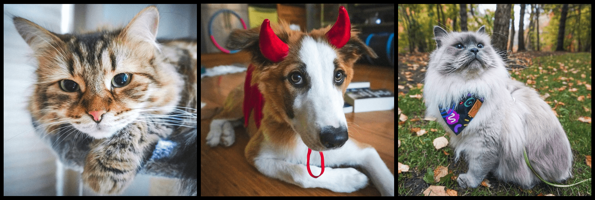

# About
I'm the Data Science Graduate Program Advisor at the [Institute of Applied Computational Sciences](https://iacs.seas.harvard.edu) at Harvard University. I'm also a machine learning researcher in the [Data to Actionable Knowledge (DtAK) lab](https://dtak.github.io). I am interested in building models with guaranteed properties that align with task-specific desiderata, such as interpretability, risk-awareness, satisfaction of domain-specific constraints. 

In a former life, I did research in pure math (specifically algebraic topology) and was an Assistant Professor of Mathematics at Saint Mary's College of California.

## Recent Work
1. Zixi Chen, Varshini Subhash, Marton Havasi, Weiwei Pan, Finale Doshi-Velez, [*A Unifying View of Properties of Machine Learning Explanations*](), Neurips Workshop on Progress and Challenges in Building Trustworthy Embodied AI, 2022.
2. Ziyan Zhu, Marios Mattheakis, Weiwei Pan, Efthimios Kaxiras, [*HubbardNet: Efficient Predictions of the Bose-Hubbard Model Spectrum with Deep Neural Networks*](), Neurips Workshop on Machine Learning and the Physical Sciences, 2022.
3. Jiayu Yao, Yaniv Yacoby, Beau Coker, Weiwei Pan, Finale Doshi-Velez, [*An Empirical Analysis of the Advantages of Finite vs. Infinite Width Bayesian Neural Networks*](), Neurips Workshop on Gaussian Processes, Spatiotemporal Modeling, and Decision-making Systems, 2022.
4. Yaniv Yacoby, Weiwei Pan, Finale Doshi-Velez, [*Mitigating the Effects of Non-Identifiability on Inference for Bayesian Neural Networks with Latent Variables*](https://arxiv.org/abs/1911.00569), JMLR, 2022.
5. Jiayu Yao, Sonali Parbhoo, Weiwei Pan, Finale Doshi-Velez, [*Policy Optimization with Sparse Global Contrastive Explanations*](http://arxiv.org/abs/2207.06269), ICML Workshop on Interpretable Machine Learning in Healthcare, 2022
6. Mark Penrod, Harrison Termotto, Varshini Reddy, Jiayu Yao, Finale Doshi-Velez, Weiwei Pan, [*Success of Uncertainty-Aware Deep Models Depends on Data Manifold Geometry*](https://responsibledecisionmaking.github.io/assets/pdf/papers/34.pdf), ICML Workshop on Responsible Decision Making in Dynamic Environments, 2022
7. Xin Zheng, Jiayu Yao, Finale Doshi-Velez, Weiwei Pan, [*From Soft Trees to Hard Trees: Gains and Losses*](https://responsibledecisionmaking.github.io/assets/pdf/papers/33.pdf), ICML Workshop on Responsible Decision Making in Dynamic Environments, 2022
8. Anita Mahinpei, Justin Clark, Isaac Lage, Finale Doshi-Velez, Weiwei Pan, [*The Promises and Pitfalls of Black-box Concept Learning Models*](http://arxiv.org/abs/2106.13314), ICML Workshop on Theoretic Foundation, Criticism, and Application Trend of Explainable AI, 2021 
9. Jiayu Yao, Emma Brunskill, Weiwei Pan, Susan Murphy, Finale Doshi-Velez, [*Power-Constrained Bandit*](https://arxiv.org/pdf/2004.06230.pdf), Machine Learning for Health Care (MLHC), 2021
10. Rylan Schaeffer, Blake Bordelon, Mikail Khona, Weiwei Pan, Ila Fiete, [*Efficient Online Inference for Nonparametric Mixture Models*](https://fietelabmit.files.wordpress.com/2021/06/final_camera_ready.pdf), Uncertainty in Artificial Intelligence (UAI), 2021

## Recent Courses
I teach undergraduate and graduate courses in data science and machine learning. I also supervise undergraduate and graduate research. Students  interested in research opportunities should **reach out directly to me**.

**AC297r** [Computational Science and Engineering Capstone Project](https://www.capstone.iacs.seas.harvard.edu), *Fall* 
**AM207** [Advanced Scientific Computing: Stochastic Optimization Methods](https://onefishy.github.io/am207/), *Fall 2019-2021* 
**DSC6232** [Machine Learning and Computational Statistics at the University of Rwanda](https://onefishy.github.io/Rwanda-Data-Science/), *Summer 2019-2021* 
**Workshop** [Data Science Workshop at the University of Rwanda](https://github.com/onefishy/rwanda_workshop), *Summer 2019* 
**AC298r** [Diversity, Inclusion and Leadership in Tech](https://onefishy.github.io/DIL_in_tech/), *Fall* 
**AC299r** Directed Graduate Research, *Spring* 
**AM91r** Directed Undergraduate Research, *Spring*

## Outreach & Community Building
Since 2018, I've been organizing the data science workshop for the annual Women in Data Science Cambridge (WiDS) conference: [WiDS Datathon Workshop 2022](https://onefishy.github.io/wids_datathon/). Since 2021, I've served as the co-director of the [Worldwide WiDS Datathon](https://www.widsconference.org).

I am the organizer of IACS's [Data Science Pedagogy Winter Workshop](https://onefishy.github.io/data-science-workshop/) for educators of underrepresented college students in data science. I am also the faculty advisor of the [IACS Graduate Advisory Committee](https://iacs-gac.github.io/pages/about.html) and the facilitator of the [IACS Diversity, Inclusion, Leadership Reading Group](https://onefishy.github.io/DIL_in_tech/reading_group.html).

I'm the faculty mentor of the IACS PhD Working Group, a working group for IACS students who are interested in receiving support and mentorship through their PhD application process. [Sign up for the 2022 PhD Working Group](https://forms.gle/cyVFBi5qoNw96DNW6). Recently, I have also begun serving as a mentor in the Career Development program at [DataPoint Armenia](https://datapoint.am/k-minds/).

## Contact
**Fall 2022 Capstone Office Hours**
 - Tuesday 1:00pm - 2:00pm in *SEC 1.312*
 - Wednesday 10:00am - 11:00am in *SEC 2.341*

**Fall 2022 Open Office Hours** 
 - Tuesday, Thursday 2.00pm-3.30pm in *SEC 1.312*
 - Wednesday, Friday 9.30am-11.00am in *SEC 2.341*

***Note for Advisees:*** During the Fall semester, please prioritize using my open office hours to address your questions. My responses to emails will be *slow*. If you want to reach out via email with advising questions, please preface the email subject with "[ADVISING]"; I may very well miss advising emails without this preface in the subject.

weiweipan (at) g (dot) harvard (dot) edu

## [*Super Important People*](https://www.instagram.com/mogu.nuomi.paigu/)

